# Catalog

- [Catalog](#catalog)
  - [Annotation(標註、註解)](#annotation標註註解)
  - [Inversion of Control(IoC)](#inversion-of-controlioc)
  - [Dependency Injection(DI)](#dependency-injectiondi)
  - [Dependency Inversion Principle(DIP)](#dependency-inversion-principledip)
  - [Bean](#bean)
  - [注入 Bean 的方法：@Autowired](#注入-bean-的方法autowired)
  - [指定注入的 Bean 的名字：@Qualifier](#指定注入的-bean-的名字qualifier)
  - [Spring AOP 的定義](#spring-aop-的定義)
  - [在 pom.xml 載入 Spring AOP](#在-pomxml-載入-spring-aop)
  - [製造切面的方法：@Aspect](#製造切面的方法aspect)
  - [什麼是 Spring MVC？](#什麼是-spring-mvc)
  - [什麼是 Http 協議？](#什麼是-http-協議)
  - [Http Request 的格式規範](#http-request-的格式規範)
  - [Http Response 的格式規範](#http-response-的格式規範)
  - [Url 的格式](#url-的格式)
  - [什麼是 Json？](#什麼是-json)
    - [Json 的格式](#json-的格式)
    - [Json 所支援的值](#json-所支援的值)
    - [如何將返回值轉換成是 Json 格式？](#如何將返回值轉換成是-json-格式)
  - [@Controller 和 @RestController 的差別在哪裡？](#controller-和-restcontroller-的差別在哪裡)
  - [GET 的用法和特性](#get-的用法和特性)
  - [POST 的用法和特性](#post-的用法和特性)
  - [在 Spring Boot 中接住參數的四個註解](#在-spring-boot-中接住參數的四個註解)
  - [什麼是 API？](#什麼是-api)
  - [什麼是 RESTful API？](#什麼是-restful-api)
  - [在 Spring Boot 中設計和實作 RESTful API](#在-spring-boot-中設計和實作-restful-api)
  - [什麼是 Http status code（Http 狀態碼）？](#什麼是-http-status-codehttp-狀態碼)
  - [什麼是 Spring JDBC？](#什麼是-spring-jdbc)
    - [Spring JDBC 根據 sql 分成兩大類：update 和 query](#spring-jdbc-根據-sql-分成兩大類update-和-query)
    - [update() 的基本用法](#update-的基本用法)
    - [query() 的用法](#query-的用法)
    - [在 Spring Boot 中操作資料庫](#在-spring-boot-中操作資料庫)
    - [什麼是 CRUD？](#什麼是-crud)
  - [什麼是軟體工程？](#什麼是軟體工程)
  - [什麼是 MVC 架構模式？](#什麼是-mvc-架構模式)
    - [Model](#model)
    - [Controller](#controller)
    - [View](#view)
    - [MVC 架構模式的優點](#mvc-架構模式的優點)
  - [在 Spring Boot 中套用 MVC 架構模式](#在-spring-boot-中套用-mvc-架構模式)
    - [Controller-Service-Dao 三層式架構](#controller-service-dao-三層式架構)
  - [ResponseEntity](#responseentity)
  - [時間格式的設定](#時間格式的設定)
  - [KeyHolder](#keyholder)
  - [Spring Boot 零基礎入門 系列](#spring-boot-零基礎入門-系列)
  - [Spring Data JPA](#spring-data-jpa)
    - [Spring Data JPA 有提供以下Interface](#spring-data-jpa-有提供以下interface)
    - [JPA(Java Persistence API)](#jpajava-persistence-api)
  - [H2 Database](#h2-database)
- [Day 11 - Spring Boot 模版引擎 x Thymeleaf](#day-11---spring-boot-模版引擎-x-thymeleaf)
  - [Thymeleaf](#thymeleaf)
  - [@Controller和@RestController差別](#controller和restcontroller差別)
    - [@Controller](#controller-1)
    - [@RestController](#restcontroller)
    - [總結](#總結)
  - [首先要將thymeleaf 的命名空間導入，在hello.html](#首先要將thymeleaf-的命名空間導入在hellohtml)
  - [Model](#model-1)
- [Day 12 - Spring Boot Thymeleaf 小小實作](#day-12---spring-boot-thymeleaf-小小實作)
  - [Thymelaeaf 表示式介紹](#thymelaeaf-表示式介紹)
  - [If 條件式](#if-條件式)
  - [可迭代物件](#可迭代物件)
- [Day 13 - Spring Boot ToDoList 使用Template Engine 實作（1）](#day-13---spring-boot-todolist-使用template-engine-實作1)
- [Day 15 - Spring Boot 向前後端分離say hi ~](#day-15---spring-boot-向前後端分離say-hi-)
  - [前後端分離](#前後端分離)
  - [Web Server](#web-server)
    - [內建 Web 伺服器的優點](#內建-web-伺服器的優點)
- [Day 16 - Spring Boot 決定就是 RESTful API 了](#day-16---spring-boot-決定就是-restful-api-了)
  - [如何設計路由？](#如何設計路由)
- [Day 18 - Spring Boot 單元測試 Service層使用Mockito](#day-18---spring-boot-單元測試-service層使用mockito)
  - [Mockito 是什麼？](#mockito-是什麼)
  - [SpringBoot 單元測試中使用 Mockito 測試Service](#springboot-單元測試中使用-mockito-測試service)
- [Day 19 - Spring Boot HTTP的請求也可以模擬測試？使用MockMvc](#day-19---spring-boot-http的請求也可以模擬測試使用mockmvc)
  - [設定Controller測試](#設定controller測試)
- [Day 21 - Spring Boot Swagger API 文件神器](#day-21---spring-boot-swagger-api-文件神器)
  - [Dependency](#dependency)
  - [Controller](#controller-2)
- [Day 23 - Spring Boot 快速建立前端ToDoList專案－ReactJS](#day-23---spring-boot-快速建立前端todolist專案reactjs)
  - [前端框架－ReactJS 快速建立一個專案](#前端框架reactjs-快速建立一個專案)
- [站在Web前端人員角度，學習 Spring Boot 後端開發 系列](#站在web前端人員角度學習-spring-boot-後端開發-系列)
- [Reference](#reference)

## Annotation(標註、註解)

- 基本上可以把註解想像成是賦予一個新的功能，不同的註解所提供的功能不一樣，並且他們的使用方法也會有點不太一樣

- E.g.:

  ```java
  @SpringBootApplication

  用法: 加在 class 上面
  用途: 表示這一個 Main 的 class，是這個 Spring Boot 程式的啟動入口
  ```

## Inversion of Control(IoC)

- 將 object 的控制權交給了外部的 Spring 容器來管理

- Control (控制)，就是對於 object 的控制權

- 所有的 object 就都是由外部的 Spring 容器來進行管理，因此當 Teacher 想要去使用印表機時，就只要跟 Spring 容器去借就好了，Teacher 就不需要自己再去「控制」這個印表機的生命週期

## Dependency Injection(DI)

- 被依賴物件並不是在依賴物件的程式中使用new產生，而是從外部「注入(inject)」至依賴物件

  ```java
  public class ShoppingCart {
    
    private PostShipping postShipping;
    
    // 由建構式從外部注入被依賴的物件至依賴的程式中 (constructor injection)
    public ShoppingCart(PostShipping postShipping) { 
      this.postShipping = postShipping;
    }
    
    private void checkout() {
      postShipping.shipOrder(order);
    }

    // 由Setter從外部注入被依賴的物件至依賴的程式中 (setter injection)
    public void setPostShipping(PostShipping postShipping) { 
      this.postShipping = postShipping;
    }

  }
  ```

  - 為什麼使用DI
    - 「依賴注入是為了解決物件間高耦合的問題」

  - 高耦合(High coupling)是指當一個被依賴對象被修改時會連帶影響依賴對象也得修改

## Dependency Inversion Principle(DIP)

- 透過介面(interface)與依賴注入的方式來降低依賴間的耦合，稱為DIP

  ```java
  /*- 運送介面 */
  public interface Shipping {
    
    public void shipOrder(Order order);

  }

  /*- 郵局貨運 */
  public class PostShipping implements Shipping {

    @Override
    public void shipOrder(Order order) { ... }

  }

  /*- 新竹貨運 */
  public class HctShipping implements Shipping {

    @Override
    public void shipOrder(Order order) { ... }

  }
  ```

  ```java
  public class ShoppingCart {
    
    private Shipping shipping; // <-- 改為Shipping介面，此為利用物建導向的多型特性。
    
    public ShoppingCart(Shipping shipping) {
      this.shipping = shipping; // 被依賴物件由外部注入，達到業務邏輯與被依賴物件的生成邏輯分開
    }
    
    private void checkout(Order order) {
      shipping.shipOrder(order);
    }

  }
  ```

## Bean

- 使用了 IoC，將 object 的控制權交給 Spring 容器來管理之後，往後的所有 object 就都是活在 Spring 容器裡面，由 Spring 容器來管理這個 object 的生命週期

- **「由 Spring 容器來管理的 object，我們賦予他們一個新的名字，就叫做 Bean」**，所以 Bean 其實就只是一個 object 而已

## 注入 Bean 的方法：@Autowired

- 使用 @Autowired 去注入一個 Bean 進來時，我們自己本身也得變成是由 Spring 容器所管理的 Bean 才可以，這樣子 Spring 容器才有辦法透過 DI (依賴注入)，將我們想要的 Bean 給注入進來
- 想要使用 @Autowired 去注入一個 Bean 時，必須滿足：

  - 必須要確保 **「自己也是一個 Bean」*- （即是有在 class 上面加上 @Component）
  - 並且 @Autowired 是透過 **「變數的類型」*- 來注入 Bean 的（所以只要 Spring 容器中沒有那個類型的 Bean，就會注入失敗）

- Example:
  - 我想注入Printer在UserController，就要再把Printer變成@Component，這樣就會變成由 Spring 容器所管理的Bean

  ```java
  package com.hello.entity;

import com.hello.entity.printer.Printer;   import org.springframework.stereotype.Component;

  @Component
  public class BrotherPrinter implements Printer{

      @Override
      public String print() {
          return "Brother Printer";
      }

      @Override
      public String print(String message) {
          return message;
      }
  }

  ```

  ```java
  @RestController
  public class UserController {

      @Autowired
      private UserService userService;
      @Autowired
      private Printer printer;

      @GetMapping("/name")
      public String getName(){
          return "hello, World! " + printer.print();
      }

      @GetMapping("/name/{message}")
      public String getNameWithMessage(@PathVariable("message") String message){
          return "hello, World! " + printer.print(message);
      }

      @GetMapping("/queryUserName/{id}")
      public String queryUserName(@PathVariable("id") String id){
          return userService.queryUserName(id);
      }
  }
  ```

## 指定注入的 Bean 的名字：@Qualifier

- 設在 Spring 容器中，同時有兩個一樣類型的 Bean 存在，那麼在這個情況下，Spring Boot 會如何運作呢？
  - 答案是：Spring Boot 會出現錯誤並且運行失敗，因為 hpPrinter 和 canonPrinter 同時都可以向上轉型成 Printer 類型，所以 Spring Boot 不知道該注入哪一個 Bean，因此錯誤原因就會是「同時有多個同樣類型的 Bean 存在，因此無法選擇要注入哪一個」
  - 「MyController required a single bean, but 2 were found」，這一行的訊息就是表示「MyController 想要注入一個 Bean，但是發現 Spring 容器中存在 2 個同樣類型的 Bean，因此注入失敗」

- @Qualifier 的用途，是去指定要注入的 Bean 的「名字」是什麼，進而解決同時有兩個同樣類型的 Bean 存在的問題

- 想要使用 @Qualifier 去指定注入一個 Bean 時，必須滿足：

  - 必須搭配 **@Autowired*- 一起使用
  - 指定的是 **「Bean 的名字」**
  - 使用 @Component 去創建 Bean 時，這些 Bean 的名字，就會是 **「Class 名的第一個字母轉成小寫」**
  - Example:
    - HpPrinter class 所生成的 Bean，名字就會叫做 hpPrinter
    - CanonPrinter 所生成的 Bean，名字就會叫做 canonPrinter

## Spring AOP 的定義

- AOP 的全稱是 **Aspect-Oriented Programming**，中文是翻譯為 **「切面導向程式設計」*- 或是 **「剖面導向程式設計」**
- AOP 的概念，就是 **「透過切面，統一的去處理方法之間的共同邏輯」**
- [教學網站](https://ithelp.ithome.com.tw/articles/10327252)

## 在 pom.xml 載入 Spring AOP

- pom.xml 這個檔案裡面新增以下的程式，將 Spring AOP 的功能給載入進來

  ```xml
  <dependency>
      <groupId>org.springframework.boot</groupId>
      <artifactId>spring-boot-starter-aop</artifactId>
  </dependency>
  ```

- 加完上述的程式之後，在 pom.xml 的右上角會出現一個 M 符號，點擊這個 M 符號，就可以更新這個 Spring Boot 程式，把 Spring AOP 的功能給載入進來

## 製造切面的方法：@Aspect

- 只有 Bean 才可以變成一個切面
  - 就是在使用 @Aspect 時，也要同時使用 @Component，將該 class 變成 Bean 的同時，切面的設定才會生效

- 在切入點方法「執行前」執行切面：@Before
  - 只要我們在這個 before() 方法的上面，去加上一個 @Before，
  - 並且在後面指定想要的切入點，
  - 就可以在這個切入點的方法 「執行前」，去執行這個 MyAspect class 中的 before() 方法了
  
  ```java
  @Aspect
  @Component
  public class MyAspect {

    @Before("execution(- com.hello.entity.printer.HpPrinter.*(..))")
    public void before() {
      System.out.println("I'm before");
    }


    @After("execution(- com.hello.entity.printer.HpPrinter.*(..))")
    public void after() {
      System.out.println("I'm after");
    }

    @Around("execution(- com.hello.entity.printer.HpPrinter.*(..))")
    public Object around(ProceedingJoinPoint pjp) throws Throwable {
      System.out.println("I'm around before");

      // 執行切入點的方法，obj 為切入點方法執行的結果
      Object obj = pjp.proceed();

      System.out.println("I'm around after");
      return obj;
    }
  }
  ```

- 如何解讀 AOP 程式？
  - 步驟一：先閱讀 @Before 小括號中的程式
    - 小括號中的程式，稱為「切入點 (Pointcut)」，即是去指定哪個方法要被切
  - 步驟二：查看前面的註解是什麼
    - 這邊所加上的，就是 @Before
    - 指定要在小括號中的切入點 「執行前」，去執行下面的 before() 方法
    - 因此在步驟二這裡，就是去確認「切面方法執行的時機點」
  - 步驟三：要執行的切面方法
    - 確認好「切入點」和「時機點」之後，最後就是在下面的 before() 方法中，去撰寫切面的程式

- 在 Spring AOP 裡面，有三種時機點可以選擇：
  - @Before：在方法「執行前」執行切面
  - @After：在方法「執行後」執行切面
  - @Around：在方法「執行前」和「執行後」，執行切面

- Spring AOP 以前最常被用在以下三個地方：
  - 權限驗證
  - 統一的 Exception 處理
  - log 記錄

## 什麼是 Spring MVC？

- 就是讓我們「在 Spring Boot 中實作前後端之間的溝通」

## 什麼是 Http 協議？

- 負責去規定資料的傳輸格式，讓前端和後端能夠有效進行資料溝通
- 在 Http 協議中，可以分為「Request (請求)」和「Response (回應)」兩部分
  - 一個 Http request 加上一個 Http response，就可以組合成一次完整的 Http 溝通

## Http Request 的格式規範

- 分成四個部分，分別是：
  - http method
    - Http 請求所使用的「請求方法」
      - 常用的有 GET、POST、PUT、DELETE..等等
  - url
    - 網站的網址
  - request header
    - 放一些請求時的通用資訊
  - request body
    - 放請求的參數
    - 只有在使用 POST 或是 PUT 這類的請求方法時，才可以去使用 request body 去傳遞參數

## Http Response 的格式規範

- 分成三個部分，分別是：
  - http status code
    - 「Http 狀態碼」
    - 用途是表達「這一次 Http 請求的結果為何」
  - response header
    - Response header 和上面的 Request header 類似，都是放一些通用的資訊
  - response body
    - 後端要傳給前端的數據
    - 請求是成功的話，前端就會去取得這個 Response body 中的數據，並且將這些數據結合前端的版面設計，最後就可以呈現完整的網頁給使用者看了

## Url 的格式

- 使用的協議
  - 在 url 的最前面，會顯示這個 url 所使用的是什麼協議
  - 像是這邊使用的就是 http 協議
- 域名
  - 協議後面會有一個 :// 做分隔，後面接著的就是這個 url 的域名
  - 以這個例子來說的話，這個 url 的域名就是「localhost」
- Port
  - 不一定會出現，是一個可選項
  - 域名後面有加上 :，並且在 : 後面有加上一個數字的話，那這個數字就是 url 所使用的 port
- url 路徑
  - port 後面，會去加上一個斜線（或是沒有 port 的話，就是在域名後面的斜線）
  - 斜線之後的所有東西，就是這個 **url 的路徑**
  - 像是這個例子中，url 路徑的值就是 **/test**

- Url 路徑對應：@RequestMapping
  - http://localhost:8080/test ，對這個 url 來說，他的 url 路徑就是最後面的 **/test**
  - @RequestMapping，並且在後面的小括號中指定 url 路徑的值 /test，這樣就可以成功將 url 路徑 /test 給對應到下面的 test 方法上
    - @RequestMapping 是一個通用的注解，可以用來映射各種類型的 HTTP 請求（GET、POST、PUT、DELETE 等）。

    ```java
    @RequestMapping(value = "/test", method = RequestMethod.GET)
    public String test() {
      return "test";
    }
    ```

    - 使用 @RequestMapping 的注意事項
      - 該 class 上面一定要上加 @Controller 或是 @RestController，否則 @RequestMapping 不會生效

## 什麼是 Json？

- 是一種格式，用途是更簡單、更直覺的去呈現數據，讓我們易於讀寫
- Example:
  - 我的學號是 123，名字是 Judy
  
  ```json
  {
      "id": 123,
      "name": "Judy"
  }
  ```

### Json 的格式

- 由一組大括號 {} 來表示一個 object

```json
{
   //....
}
```

- Key 和 Value 的概念
  - 在 Json 中的所有 key，**都必須要加上雙引號 " "*- 來框住才可以
  - key 為 id，並且 value 為 123

  ```json
  {
      "id": 123,
      "name": "Judy"
  }
  ```

### Json 所支援的值

- 整數
  - "id": 123
- 浮點數
  - "score": 1.111
- 字串
  - "name": "Hello"
- Boolean
  - "option": true
- List
  - "list": [1, 2, 3]

### 如何將返回值轉換成是 Json 格式？

- 兩個步驟
  - 在 class 上面加上 @RestController
  - 將該方法的返回值，改成是一個「Java 中的物件」

  ```java
    @RequestMapping("/user")
    public Student user(){
        Student student = new Student();
        student.setName("Scoot");
        return student;
    }
  ```

## @Controller 和 @RestController 的差別在哪裡？

- 共同點：
  - 都可以將 class 變成 Bean、也都可以將裡面的 @RequestMapping 生效
- 差別：
  - @Controller：將方法的返回值自動轉換成前端模板的名字
  - @RestController：將方法的返回值自動轉換成 Json 格式

## GET 的用法和特性

- 當你使用 GET 方法時，你所傳遞的參數就會被別人所看見
- 前端只能夠將參數放在 url 的最後面，透過這個格式將參數傳遞給後端
  - url 的最後面，寫上 id=123&name=Judy 時
    - 要傳遞 「id 為 123，並且 name 為 Judy」的參數資訊給後端，
    - 這種寫在 url 最後面的參數一個名字，叫做「query parameter」

## POST 的用法和特性

- 當你使用 POST 方法時，你所傳遞的參數就可以隱藏起來，不被別人看見
- 使用 POST 請求時，Http 協議就規定「前端要將參數放在 request body 中做傳遞」
  - 由於 request body 會被封裝起來，因此參數不會洩漏
  - 放在 request body 中的參數格式，是以 Json 格式來撰寫的

## 在 Spring Boot 中接住參數的四個註解

- @RequestParam
  - 接住放在 Url 後面的參數
  - 注意事項
    - 參數名字須一致
      - Spring Boot 中的變數的「名字」，必須要和 url 中的參數的「名字」一樣才可以
    - 參數類型需一致
  - Example:
    - http://localhost:8080/name?date=0823

  ```java
    @RequestMapping("/name")
    public String getName(@RequestParam String date){
        return "hello, World! " + printer.print() + " " + date;
    }
  ```

- @RequestBody
  - 接住放在 request body 中的參數
  - 創建一個和這個 Json 格式「一一對應」的 Java class 出來
  
  ```json
  {
    "id": "112598019",
    "name": "Scott"
  }
  ```

  ```java
  public class Student {
    
    private Integer id;
    private String name;

    // getter 和 setter
    public Integer getId() {
        return id;
    }

    public void setId(Integer id) {
        this.id = id;
    }

    public String getName() {
        return name;
    }

    public void setName(String name) {
        this.name = name;
    }
  }
  ```

  - 注意事項
    - Json 格式轉換要小心
      - 和 Json 格式一一對應的 Java class
  
- @RequestHeader
  - 接住放在 request header 中的參數
  - 前端也是可以在 request header 中傳遞參數給後端的（通常前端是會將「權限認證」或是「通用資訊」，放在 request header 中傳遞）

  ```java
    @RequestMapping("/header")
    public String header(@RequestHeader String info){
        return info;
    }
  ```

- @PathVariable
  - 接住放在 url 路徑中的值
  - 注意事項
    - 「url 路徑」和「參數」的名字要一致
    - 參數類型需一致

    ```java
      @GetMapping("/name/{message}")
      public String getNameWithMessage(@PathVariable("message") String message){
          return "hello, World! " + printer.print(message);
      }
    ```

  - 為什麼我們需要 @PathVariable？
    - 假設我們要傳遞 id 為 123 的參數給前端的話，其實完全可以使用 **@RequestParam*- 來傳遞
    - 為什麼要大費周章把 123 的值給塞到 **url 路徑*- 裡面，然後再透過 **@PathVariable** 來取得
    - 就是 **「為了支援 RESTful API 的設計風格」**
  
## 什麼是 API？

- 用特定的格式，去表示某個功能到底要怎麼使用
- API 的目的，就是「用工程師看得懂的方式，去說明某個方法要如何使用」
- Example:
  - 把「取得商品列表」的 API 給定義好了，
  - 像是我們會去說明
    - 要使用 GET 方法來請求、
    - 並且請求參數 (query parameter) 要帶上什麼、
    - 以及可能的 Http response 回覆會是什麼
    - 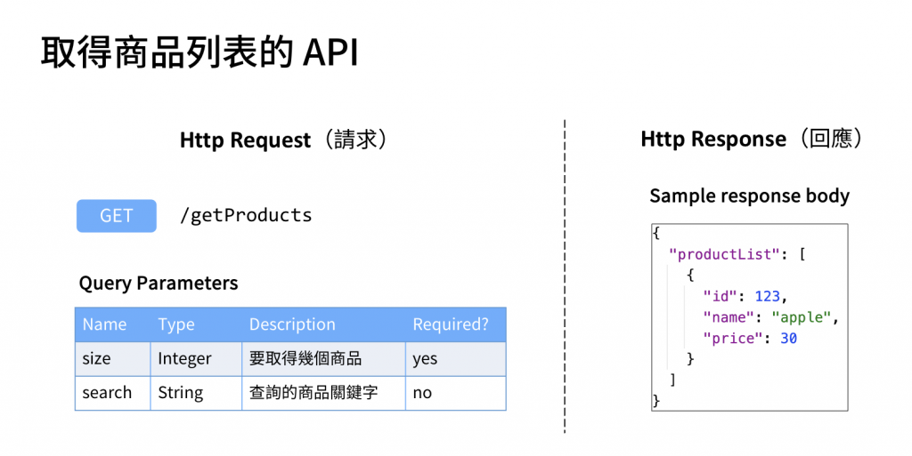

## [什麼是 RESTful API？](https://ithelp.ithome.com.tw/articles/10335071)

- 符合 REST 風格的 API
- 是一種網路架構風格，
  - 使用 HTTP、URI、JSON、HTML，API設計具有整體一致性，易於維護、擴展，充分運用HTTP協定的特點，
  - 並使用 HTTP status code 來代表該資源的狀態，在不同軟體間，網際網路互相傳遞資源
- RESTful API 會使用統一的介面，有助於讓用戶端與服務端實作分離，會使用 JSON 作為交換資料格式
- REST是設計風格而不是不是設計 API 的標準規範
  - 目的是為了不同軟體間能夠傳遞資料，
  - 簡單並清晰的設計原則，可以讓溝通更加順暢，
  - 可以依照開發需求修改相對應的風格。
- RESTful API 的設計
  - 使用 Http method 表示動作
    - POST、GET、PUT、DELETE 分別去對應到資料庫的 Create、Read、Update、Delete 操作
    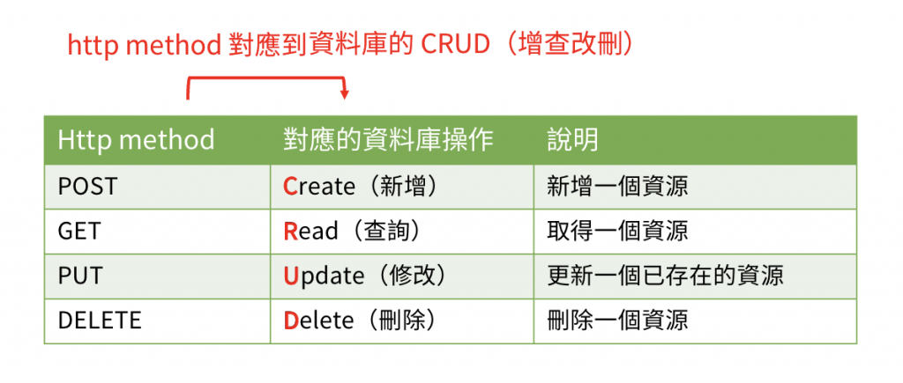
  - 使用 url 路徑來描述資源之間的階層關係
    - Example:
      - 有一個 API GET /users
        - 根據我們剛剛所介紹的 REST 風格，知道 GET 是去對應到資料庫的「Read 查詢」操作，
        - 因此這個 API GET /users 的含義，就是去「取得所有的 user」
      - 另一個 API GET /users/123
        - 這個 API 的含義，就是去「取得在所有的 user 裡面，user id 為 123 的那個 user」
      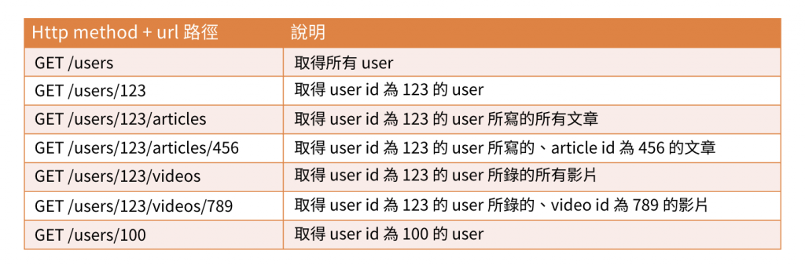
  - 使用 Json 或是 Xml 回傳
    - REST 風格會要求後端程式所回傳的 response body，必須要是 Json 或是 Xml 的格式
    - 其實就是在 class 上面加上 @RestController，這樣就可以正確的返回 Json 格式了

    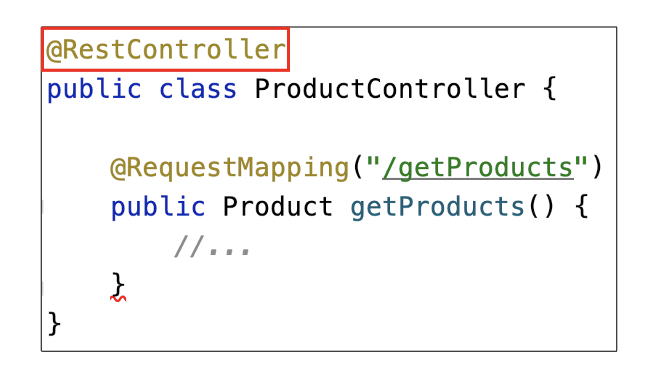

## 在 Spring Boot 中設計和實作 RESTful API

```java
@RestController
public class StudentController {

    @PostMapping("/students")
    public String create(@RequestBody Student student){
        return "執行資料庫的Create操作";
    }

    @GetMapping("/students/{id}")
    public String read(@PathVariable String id){
        return "執行資料庫的Read操作";
    }

    @PutMapping("/students/{id}")
    public String update(@PathVariable String id,
                         @RequestBody Student student){
        return "執行資料庫的Update操作";
    }

    @DeleteMapping("/students/{id}")
    public String delete(@PathVariable String id){
        return "執行資料庫的Delete操作";
    }
}
```

## 什麼是 Http status code（Http 狀態碼）？

- 屬於 Http response 的一部分
- 表示這次 Http request 的結果為何

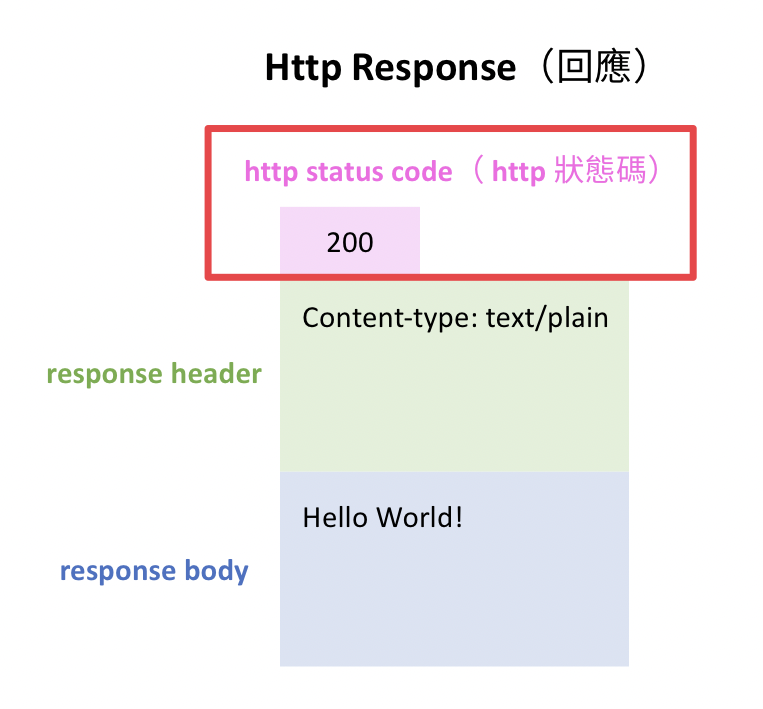

- Http status code 中的分類
  - 1xx : 資訊
    - 取得資訊
  - 2xx : 成功
    - 200 OK
      - 這一次的 http 請求成功了
    - 201 Created
      - http 請求成功且表示「有一個新的資源成功被創建了
    - 202 Accepted
      - 這一次的請求已經被接受了，但是尚未處理完成

    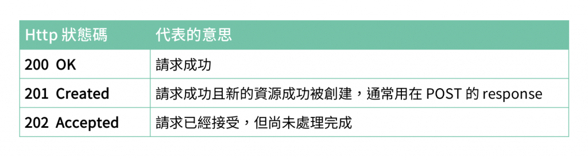

  - 3xx : 重新導向
    - 301 Moved Permanently
      - 這個 url 永久性的搬家了
        - 通常後端在回傳 301 的時候，同時也會將新的 url 放在 response header 裡面，告訴前端要去哪裡找新家，所以前端就可以改成去請求這個新的 url
    - 302 Found
      - 這個 url 暫時性的搬家
        - 通常後端在回傳 302 的時候，也是會將新的 url 放在 response header 裡面，告訴前端要去哪裡找新家，所以前端就可以改成去請求這個新的 url
    - 301 和 302 差在哪裡？
      - 就只是這個 url 是「永久性的搬家」還是「暫時性的搬家」而已
      - 對於後端這邊來說，在設計上都是要將新的 url 放在 response header 裡面，告訴前端新的 url 在哪裡

    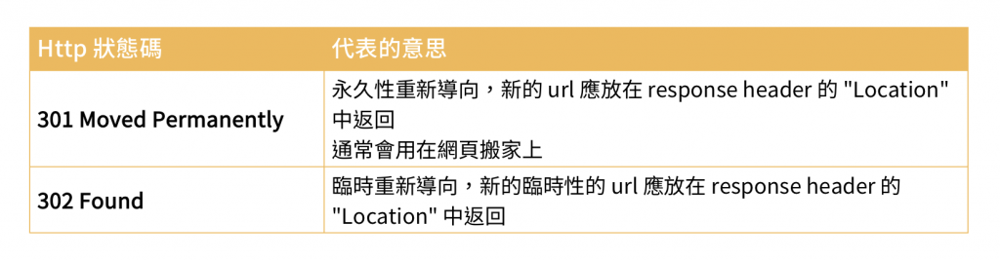

  - 4xx : 前端請求錯誤
    - 400 Bad Request
      - 前端的請求參數有錯誤
    - 401 Unauthorized
      - 沒有通過身份驗證
      - Example:
        - 帳密輸入錯誤
    - 403 Forbidden
      - 這一次的請求被後端拒絕」，
      - 這個拒絕通常是因為 **權限不足*- 導致的
      - Example:
        - 這個會員他沒有權限，去執行這個功能
    - 404 Not Found
      - 這個網頁不存在
      - 通常就是由於 url 輸入錯誤、或是 url 失效（該資源被移走）所導致的

    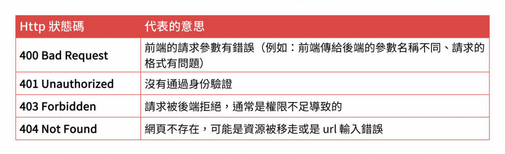

  - 5xx : 後端處理有問題
    - 500 Internal Server Error
      - 後端在處理這次請求的時候發生了錯誤
      - 可能是因為後端程式出了 bug、或是其他的原因造成的
    - 503 Service Unavailable
      - 臨時維護或者流量太大，所以後端目前沒有辦法處理請求
    - 504 Gateway Timeout
      - 這一次的請求超時了
      - http 請求花了太長的時間都還沒有完成，所以就直接強制結束

    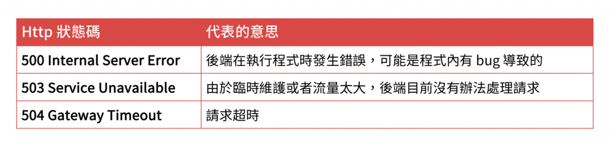

## 什麼是 Spring JDBC？

- 能夠在 Spring Boot 中執行 sql 語法，進而去操作資料庫

### Spring JDBC 根據 sql 分成兩大類：update 和 query

- 在 update 系列的方法中，可以去執行
  - INSERT、
  - UPDATE、
  - DELETE 這三種 sql 語法
- 而在 query 系列的方法中，只能執行
  - SELECT 這一種 sql 語法

### update() 的基本用法

- 分成 4 個步驟
  - 注入一個 NamedParameterJdbcTemplate
    - 在你的 Bean 裡面，先去注入

    ```java
    @Autowired
    private NamedParameterJdbcTemplate namedParameterJdbcTemplate;
    ```

    - NamedParameterJdbcTemplate
      - 是 Spring JDBC 自動幫我們生成的 Bean，
      - 負責去處理和資料庫溝通的所有事項

  - 撰寫 sql 語法
    - 注意database要對，table和column也要對
  
  ```java
  String sql = "INSERT INTO student(id, name) VALUES (3, 'John')";
  ```

  - 新增一個 Map<String, object> 的 map 變數
    - 放 sql 語法裡面的變數的值
      - 想要「動態的決定」當前 sql 語法中的值的話，那就需要依靠 map
        - 修改 sql 語法、添加 map 變數中的值
          - sql 語法：將「3 和 John」的地方，改成「:studentId 和 :studentName」
            - :studentId
            - 就表示我們指定這是一個 sql 中的變數，名字叫做 studentId
            - :studentName
            - 就表示我們指定這又是另一個 sql 中的變數，名字則是叫做 studentName
          - map 變數：在 map 變數中 put 兩組 key-value 的值進去

           ```java
               @RequestMapping("/students/insert/map")
              public String insertMap(@RequestBody Student student){
                  String sql = "INSERT INTO user(id, user_name) VALUES (:studentId, :studentName)";
                  Map<String, Object> map = new HashMap<>();
                  map.put("studentId", student.getId());
                  map.put("studentName", student.getName());
                  namedParameterJdbcTemplate.update(sql, map);
                  return "執行 INSERT SQL";
              } 
            ```
  
  ```java
  Map<String, Object> map = new HashMap<>();
  ```

  - 使用 update() 方法
    - 使用 namedParameterJdbcTemplate 的 update() 方法，
    - 並且把上面所新增的 sql 和 map 這兩個變數，依照順序的給傳進去
  
  ```java
    @Autowired
    private NamedParameterJdbcTemplate namedParameterJdbcTemplate;

    @RequestMapping("/students/insert")
    public String insert(){
        String sql = "INSERT INTO user(id, user_name) VALUES (3, 'John')";
        Map<String, Object> map = new HashMap<>();
        namedParameterJdbcTemplate.update(sql, map);
        return "執行 INSERT SQL";
    }
  ```

### query() 的用法

- 前兩個參數和 update() 方法一樣，都是先放入「要執行的 sql 語法」，接著是放入「動態決定 sql 變數的 map」
- 特別的地方，就在於他的第三個參數 RowMapper
  - 將資料庫查詢出來的數據，轉換成是 Java object
  - 像是我們可以創建一個新的 StudentRowMapper class，然後讓他去 implements RowMapper 這個 interface，實作如下的程式：

  ```java

  package com.hello.mapper;

  import com.hello.entity.other.Student;
  import org.springframework.jdbc.core.RowMapper;


  import java.sql.ResultSet;
  import java.sql.SQLException;

  public class StudentRowMapper implements RowMapper<Student> {
      @Override
      public Student mapRow(ResultSet rs, int rowNum) throws SQLException{
          Student student = new Student();
          student.setId(rs.getInt("id"));
          student.setName(rs.getString("user_name"));
          return student;
      }

  }
  ```

  ```java
    @RequestMapping("/students/query/{id}")
    public List<Student> query(@PathVariable String id){
        String sql = "SELECT id, user_name from user where id= :studentId";
        Map<String, Object> map = new HashMap<>();
        RowMapper<Student> rowMapper = new StudentRowMapper();
        map.put("studentId", id);
        return namedParameterJdbcTemplate.query(sql, map, rowMapper);
    }
  ```

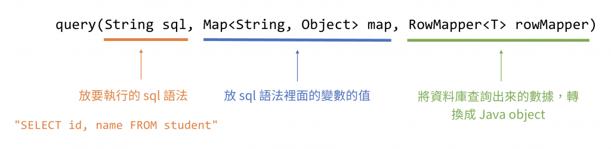

### 在 Spring Boot 中操作資料庫

- 常見的操作資料庫的工具有:
  - 在 Spring Boot 中執行 sql 語法，去操作資料庫
    - 直接在 Spring Boot 中去執行原始的 sql 語法，然後透過這些 sql 語法去存取資料庫的數據這樣
    - Spring JDBC
    - MyBatis
  - 使用 ORM(Object Relational Mapping) 的概念，去操作資料庫
    - 使用這類的工具，基本上就很少寫 sql 語法了，而是會套用另一種新的概念（即是 ORM），去存取資料庫的數據
    - Spring Data JPA
    - Hibernate

### 什麼是 CRUD？

- Create（新增）
- Read（查詢）
- Update（修改）
- Delete（刪除）

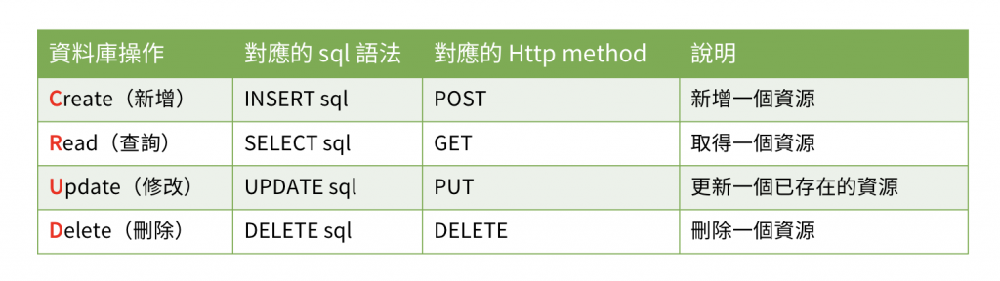

## 什麼是軟體工程？

- 在面對一個 **大型的系統*- 時，工程師們要 **如何分工合作**，一起去解決問題？
- 當你今天要寫的是一個超過一兩千行的程式，並且你們的團隊中，是有好幾位工程師一起分工合作，在這種情況下，就會開始需要去注重 「軟體工程」

## 什麼是 MVC 架構模式？

- 將一個系統，去拆分成 **「Model、View、Controller」** 三個部分，並且讓每一個部分都各自負責不同的功能

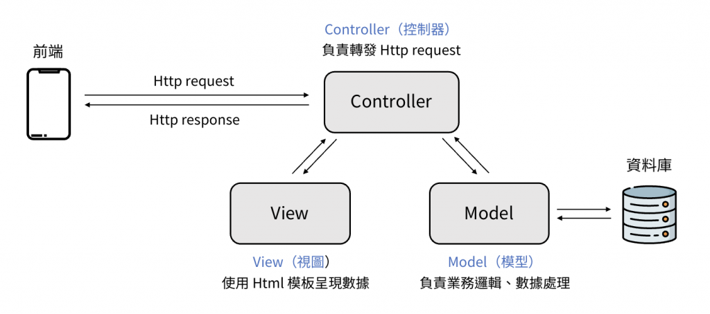

### Model

- 實作業務邏輯，並且處理數據
- 因為 Model 是負責處理數據，因此 Model 會需要去跟資料庫做溝通，將這些數據的改動給儲存起來
- 所以我們都會將核心的業務邏輯，寫在 Model 這個部分裡面

### Controller

- 轉發 Http request
- 收到來自前端的 Http request 之後，Controller 就會負責將這些 request，去轉發給 Model，讓 Model 去處理後續的操作

### View

- 使用 Html 的模板去呈現數據
- 近幾年提倡「前後端分離」的關係，
- 所以版面設計就都會交給前端處理，
- 因此在後端這裡，就不需要處理 Html 的版面部分，改成是使用 Json 格式來傳遞數據給前端，
- 因此 View 這部分，相對來說就變得越來越不重要

### MVC 架構模式的優點

- 職責分離，更容易維護程式
- 使程式結構更直覺，有利於團隊分工
- 可重複使用寫好的程式

## 在 Spring Boot 中套用 MVC 架構模式

- 將MVC的架構模式，去轉化成是 **「Controller-Service-Dao*- 的三層式架構」

### Controller-Service-Dao 三層式架構

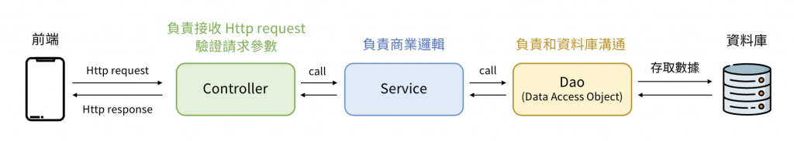

- Controller 層
  - 接收前端傳過來的 Http request，並且去驗證請求參數
  - Example:
    - 凡是和「前端」進行溝通的部分，就通通會放在 Controller 層裡面
    - @RequestMapping、@RequestParam...等等
- Service 層
  - 商業邏輯的處理
  - 當 Controller 層接收到前端傳過來的 Http request、並且對其驗證之後，這時候Controller 就會去 call Service層，讓 Service 負責去接手後續的處理
  - 而 Service 層在處理商業邏輯的過程中，Service 層會再去 call Dao這一層
- Dao 層
  - 專門去和資料庫進行溝通的
  - 會透過 sql 語法，去操作資料庫，進而去查詢/修改資料庫中的數據
  - 凡只要是和「資料庫」溝通的部分，就通通是會放在 Dao 層裡面
  - 會幫助我們封裝資料庫進行持久層的操作
- 優點：
  - 良好的共用性與擴充性
  - 良好安全性
  - 後期維護成本低
  - 有利於摽準化
- 缺點：
  - 由於每一層有上下關聯需要修改，如果Controller增加功能，勢必Service層與Dao層也需要增加相對應的程式碼，比起直接使用不分層架構，會更降低系統的效能。
  
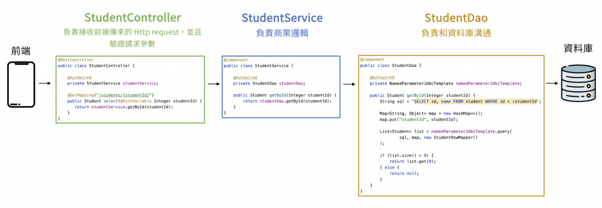

- 將原本的程式，由 1 個 class 拆分成 3 個 class，分別透過 StudentController、StudentService、StudentDao 這三個 class
- 因此後續在維護上，假設我們想修改「查詢的 sql 語法」，那我們就只要去修改 StudentDao 中的程式即可
- 又或是我們想要修改的是「前端的請求參數」，那我們就只要去修改 StudentController 中的程式即可

- 注意事項
  - 透過 Class 名字結尾，表示這是哪一層
  - 將 Controller、Service、Dao，全部變成 Bean
  - 不能在 Controller 中直接使用 Dao
    - Controller 就一定只能去 call Service，再讓 Service 去 call Dao
  - Dao 層只能執行 sql 語法，不能添加商業邏輯
    - 所以像是取得資料庫的數據之後，假設想要進行排序、或是篩選之類的動作，就得回到 Service 層再處理
    - 保持 Dao 是非常單純的和資料庫溝通，一切複雜的商業邏輯處理，就通通回到 Service 層進行

## ResponseEntity

- 是 Spring 框架中一個用來表示 HTTP 響應的類，它可以包含響應的狀態碼、響應頭和響應體。
- 使用 ResponseEntity 可以更加靈活地控制 HTTP 響應的詳細信息，而不僅僅是返回一個響應體對象。

```java
@GetMapping("/books/{bookId}")
public ResponseEntity<Book> getBook(@PathVariable Integer bookId) {
    Book book = bookService.getBookById(bookId);

    if (book != null) {
        return ResponseEntity.status(HttpStatus.OK).body(book);
    } else {
        return ResponseEntity.status(HttpStatus.NOT_FOUND).build();
    }
}
```

## 時間格式的設定

- Spring Boot 預設的時間格式，是 2018-05-22T16:00:00.000+00:00 的格式
- 而如果想要改變這個格式，將他變成是 2018-05-23 00:00:00 的話，會需要在 **application.properties*- 檔案中進行設定

```properties
spring.jackson.time-zone=GMT+8
spring.jackson.date-format=yyyy-MM-dd HH:mm:ss
```

```yml
spring:
  jackson:
    time-zone: GMT+8
    date-format: yyyy-MM-dd HH:mm:ss
```

## KeyHolder

- 這個算是 update() 的一種進階用法，即是在創建一筆數據到資料庫時，可以取得到 **「由資料庫所生成的 id」**
- 因為在設計 book table 時，其中的 book_id 欄位，我們是設定成 AUTO_INCREMENT
  - 會導致一種現象，即是「我們在 Spring Boot 中插入了一筆數據，但是我們卻不知道這筆數據的 id 值是多少」

## [Spring Boot 零基礎入門 系列](https://ithelp.ithome.com.tw/articles/10339561)

## Spring Data JPA

- Spring Data 提供了持久層(Data Persistence Layer)的支援，
- 目的是希望與 Spring 其他元件易於整合，物件導向模型(ORM)來看待持久層，
- ORM讓Model資料層與資料訪問層做了關聯，當作一個中繼資料，用操作物件的方式對資料庫進行操作。
- Spring 基於ORM框架、JPA規範封裝的一套JPA應用框架，底層使用了Hibernate，可以使開發者用簡單的程式碼實現對資料庫溝通與操作，包含了新增、修改、刪除等

### Spring Data JPA 有提供以下Interface

- Repository 最頂層的介面
- CrudRepository 是Repository的子介面，提供CRUD的功能
- PagingAndSortingRepository 是CrudRepository的子介面，添加分頁和排序的功能
- JpaRepository 是PagingAndSortingRepository的子介面

```java
import com.caili.todolist.entity.Todo;
import org.springframework.data.repository.CrudRepository;

// 第一個參數為訪問的實體，第二參數是這個Entity ID的資料型態
public interface TodoDao extends CrudRepository<Todo, Integer> {

}
```

```java
@Service
public class TodoService {
    @Autowired
    TodoDao todoDao;

    public Iterable<Todo> getTodo() {
        return todoDao.findAll();
    }
}
```

### JPA(Java Persistence API)

- 利用標註 Annotation 的方式或XML描述物件與關係表的對應關係，import 套件時的package路徑為 javax.persistence.*，
- 常見如：@Entity、@Table、@Column、@Transient等標註 Annotation。

## H2 Database

- H2 屬於記憶體型資料庫，即全部儲存的資料內容是存放在伺服器記憶體中，也因此讀寫效能相對較高，但當伺服器關閉時資料也會立即消失
- H2 是利用 Java 所設計出的關聯式資料庫，目前是一款具開源、免費、輕量與速度相當快的資料庫引擎，當我們在專案引用時，自動會提供瀏覽器的管理控制台，支援 JDBC、ODBC API 和 SQL語法。

# Day 11 - Spring Boot 模版引擎 x Thymeleaf

## Thymeleaf

- 是一個Java庫，它是一個XML/HTML5模板引擎，能夠應用轉換於模板檔案，以顯示應用程式產生的資料，撰寫Thymeleaf就像是在寫HTML。
- 在Web應用程式中，Thymeleaf旨在成為JSP的完全替代品，模版檔案可以直接在瀏覽其中打開。
- 通常用於生成動態 HTML 頁面

## @Controller和@RestController差別

### @Controller

- 是一個通用的 Spring MVC 控制器註解，用於標識一個類作為控制器，
- 該類的處理方法通常會返回一個視圖名稱，並且該視圖會被解析為 HTML 頁面。
- Example: 在這個例子中，hello 是一個視圖名稱，可能對應於一個 hello.html 或 hello.jsp 模板文件。

```java
@Controller
public class MyController {

    @GetMapping("/hello")
    public String hello() {
        return "hello"; // 返回視圖名稱 "hello"
    }
}
```

### @RestController

- 是 @Controller 和 @ResponseBody 的結合體。用於創建 RESTful 網絡服務。
- 這個註解標記的類中的所有方法都會自動將返回值轉換為 JSON 或 XML 並直接寫入 HTTP 響應體
- Example: 在這個例子中，hello() 方法的返回值 "Hello, World!" 將直接作為 HTTP 響應體返回，並且以 JSON 格式返回給客戶端，例如：{"message":"Hello, World!"}。


```java
@RestController
public class MyRestController {

    @GetMapping("/hello")
    public String hello() {
        return "Hello, World!"; // 返回 JSON 格式的數據
    }
}
```

### 總結

- @Controller：用於處理視圖的控制器，通常用來返回視圖頁面。適合需要渲染 HTML 頁面的應用。
- @RestController：用於處理 RESTful API 的控制器，直接返回數據（例如 JSON 或 XML），適合用來構建 RESTful 網絡服務。

## 首先要將thymeleaf 的命名空間導入，在hello.html

- 在使用 Thymeleaf 作為模板引擎時，你需要在 HTML 文件（如 hello.html）中引入 Thymeleaf 的命名空間，以便能夠使用 Thymeleaf 提供的標籤和屬性來處理模板數據。
- Example:
  - xmlns:th="http://www.thymeleaf.org"：
    - 定義 th 作為 Thymeleaf 的命名空間前綴，讓你可以使用像 th:text 這樣的屬性來處理模板中的數據。
  - th:text="'Hello, World!'"：這是 Thymeleaf 的一個屬性，將動態生成的文本 "Hello, World!" 替換掉 HTML 文件中原有的靜態文本 "Hello, static text"。

```html
<!DOCTYPE html>
<html xmlns:th="http://www.thymeleaf.org">
<head>
    <title>Hello Thymeleaf</title>
</head>
<body>
    <h1 th:text="'Hello, World!'">Hello, static text</h1>
</body>
</html>
```

## Model

- 在 Spring MVC 中，Model 是一個接口，用來在Controller和View之間傳遞數據。它的主要功能是將數據綁定到View上，使得View（通常是 HTML 頁面）可以訪問這些數據並進行顯示。
- 作用
  - 傳遞數據：
    - Model 用來將Controller中的數據傳遞到View層。
    - 可以將任何 Java object（如字符串、集合、實體object等）添加到 Model 中，然後在View模板中使用這些數據。
  - 存儲和綁定數據：
    - 在Controller方法中，你可以通過 model.addAttribute("key", value) 將數據存儲到 Model 中，"key" 是數據在View中的名稱，value 是要傳遞的數據。
  - 與View模板結合：
    - 當Controller返回一個View名稱時，Spring MVC 會將 Model 中的數據與View模板結合，從而生成最終的 HTML 頁面。

```java
@Controller
public class appController {

    @GetMapping("/hello")
    public String hello(Model model) {
        model.addAttribute("hello", "Hello World!!!");
        return "hello";
    }
}
```

```html
<body>
<h1 th:text="${hello}"></h1>
</body>
```

# Day 12 - Spring Boot Thymeleaf 小小實作

## Thymelaeaf 表示式介紹

- 變數表示式
- 選擇或星號表示式，類似變數表示式，但上層需要有一個變數物件，子層承接上下文。
- 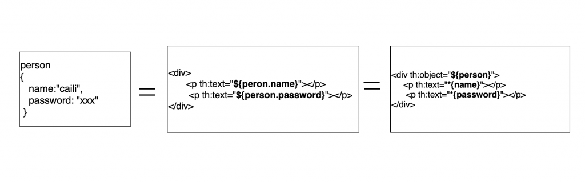
  ```html
  <h1>顯示資料</h1>
  <p th:text="'Name：' + ${person.name}"></p>
  <p th:text="'Password：'+ ${person.password}"></p>
  <p></p>
  ```
- URL表示式，把一個資訊新增到URL中
- Example:
  - th:action="@{/add}" 觸發submit 時，form action 導至 /add 路徑，form 方法為POST，並且會將表單數據提交到 /add
  ```html
  <h2>Add Form</h2>
  <form action="#" th:action="@{/add}" th:object="${person}" method="post">
      <input type="text" th:field="*{name}"/>
      <input type="password" th:field="*{password}"/>
      <input type="submit"/>
  </form>
  ```

## If 條件式

```java
@Controller
public class appController {
	@GetMapping("person")
	    public String showGender(Model model) {
	        model.addAttribute("gender", "female");
	        return "person";
	 }
}
```

```html
<!DOCTYPE html>
<html lang="en" xmlns:th="http://www.thymeleaf.org">
<head>
    <meta charset="UTF-8">
    <title>Title</title>
</head>
<body>
		<p th:if="${gender} == 'male'">我是男生</p>
		<p th:if="${gender} == 'female'">我是女生</p>
</body>
</html>
```

## 可迭代物件

```java
@Controller
public class appController {
    @GetMapping("list")
    public String listNumber (Model model) {
        List<String> list = new ArrayList<>();
        for(int i = 0; i<= 10; i++) {
            list.add("This is ArrayList" + i);
        }
        model.addAttribute("list", list);
        return "list";
    }
}
```

```html
<!DOCTYPE html>
<html lang="en" xmlns:th="http://www.thymeleaf.org">
<head>
    <meta charset="UTF-8">
</head>
<body>
   <!--用th:each接收一個可迭代的物件，將thymeleaf傳遞過來的參數"list"，別名為i-->
    <ul th:each="i:${list}">
        <!--將i渲染至畫面-->
        <li th:text="${i}">
        </li>
    </ul>
</body>
</html>
```

# Day 13 - Spring Boot ToDoList 使用Template Engine 實作（1）

- Todo.java Entity
```java
package com.hello.entity.TodoList;

import jakarta.persistence.*;

@Entity
@Table
public class Todo {
    @Id
    @GeneratedValue(strategy = GenerationType.IDENTITY)
    Integer id;

    @Column
    String task;

    @Column
    Integer status;

    @Column
    String createTime;

    @Column
    String updateTime;

    public Integer getId() {
        return id;
    }

    public void setId(Integer id) {
        this.id = id;
    }

    public String getTask() {
        return task;
    }

    public void setTask(String task) {
        this.task = task;
    }

    public Integer getStatus() {
        return status;
    }

    public void setStatus(Integer status) {
        this.status = status;
    }

    public String getCreateTime() {
        return createTime;
    }

    public void setCreateTime(String createTime) {
        this.createTime = createTime;
    }

    public String getUpdateTime() {
        return updateTime;
    }

    public void setUpdateTime(String updateTime) {
        this.updateTime = updateTime;
    }
}
```
- TodoDao.java Dao
```java
package com.hello.dao;

import com.hello.entity.TodoList.Todo;
import org.springframework.data.repository.CrudRepository;

public interface TodoDao extends CrudRepository<Todo, Integer> {
}
```

- TodoService.java Service
  - getTodo() 透過todoDao.findAll()去操作資料庫回傳所有資料
  - createTodo() 透過todoDao.save() 存去資料至資料庫

```java
package com.hello.service.impl;

import com.hello.dao.TodoDao;
import com.hello.entity.TodoList.Todo;
import org.springframework.beans.factory.annotation.Autowired;
import org.springframework.stereotype.Service;

import java.text.SimpleDateFormat;
import java.util.Date;
import java.util.TimeZone;

@Service
public class TodoService {

  @Autowired
  TodoDao todoDao;

  public Iterable<Todo> getTodo() {
    return todoDao.findAll();
  }

  public Iterable<Todo> createTodo(Todo todo) {
    SimpleDateFormat df = new SimpleDateFormat("yyyy-MM-dd HH:mm:ss");

    df.setTimeZone(TimeZone.getTimeZone("Asia/Taipei"));

    Date date = df.format(new Date());
    todo.setCreateTime(date);
    todo.setUpdateTime(date);
    todoDao.save(todo);
    return getTodo();
  }
}
```

- TodoController.java Controller
  - 透過POST提交了表單。
  - 提交了表單後，重新刷新頁面時，瀏覽器會詢問「確認重新提交表單」按確定之後就會重新POST /todos一模一樣的內容，這樣畫面列表會多一列，Web表單通過HTTP POST請求提交給server而刷新頁面時會導致內容重複提交，
  - 可以採取Post / Redirect / Get 設計模式，為的是轉換POST請求，避免二次提交。

```java
package com.hello.controller.TodoList;

import com.hello.entity.TodoList.Todo;
import com.hello.service.impl.TodoService;
import org.springframework.beans.factory.annotation.Autowired;
import org.springframework.stereotype.Controller;
import org.springframework.ui.Model;
import org.springframework.web.bind.annotation.GetMapping;
import org.springframework.web.bind.annotation.ModelAttribute;
import org.springframework.web.bind.annotation.PostMapping;

@Controller
public class TodoController {

    @Autowired
    private TodoService todoService;

    @GetMapping("/todos")
    public String getTodoList(Model model){
        Iterable<Todo> todoList = todoService.getTodo();
        model.addAttribute("todoList", todoList);
        Todo todo = new Todo();
        model.addAttribute("todoObject", todo);
        return  "todoList";
    }

    @PostMapping("/todos")
    public String createTodo(@ModelAttribute Todo todo, Model model){
        Iterable<Todo> allTodoList = todoService.createTodo(todo);
        Todo emptyTodo = new Todo();
        model.addAttribute("todoList", allTodoList);
        model.addAttribute("todoObject", emptyTodo);
        return "redirect:/todos";
    }
}
```

- todolist.html Template
```html
<!DOCTYPE html>

<html lang="en" xmlns:th="http://www.thymeleaf.org">

<head>
    <meta charset="UTF-8">
    <link rel="stylesheet" th:href="@{/style.css}">
    <link href="https://fonts.googleapis.com/css2?family=Roboto:wght@400;500;700&display=swap" rel="stylesheet">
    <title>Todo List</title>
</head>

<body>
<div class="container">
    <h2>To Do List</h2>
    <form class="header" th:action="@{/todos}" method="post" th:object="${todoObject}">
        <input type="text" id="input" placeholder="New Item..." th:field="*{task}">
        <button type="submit" class="addBtn">Add</button>
    </form>
    <ul th:each="todo: ${todoList}">
        <li><span th:text="${todo.task}"></span> <span class="close">x</span></li>
    </ul>
</div>
</body>
</html>
```

# Day 15 - Spring Boot 向前後端分離say hi ~

## 前後端分離

- 前端追求的是：
  - 頁面表現，速度流暢，兼容性，用戶體驗等等。
- 後端追求的是：
  - 高可用，高性能，安全，存儲，業務。
- 前後端分離優缺點：
  - 優點：
    - 發現bug時，可以快速定位是誰的問題（依照問題的種類可以快速辨別要找哪一端處理）
    - 增加程式的維護性與易讀性
    - 前端大量的元件代碼可以重複使用，組件化
    - 後端服務暫時超時，還是可以看到頁面，只是數據出不來而已。
    - 前端可以自由選擇框架或是使用Vanilla JS，後端當然也可以自由選擇語言(Java, Python等)
  - 缺點：
    - 溝通成本會提高
    - 因為透過資料介面來做為溝通的媒介，所以非常依賴API文件
    - SEO的難度變大
      - Thymeleaf 模版經由後端渲染資料的SSR（Server Side Rendering）就擁有SEO（搜尋引擎優化）的優點。
      - SEO是搜尋引擎優化的簡寫(Search Engine Optimization)
      - 執行SEO是為了讓網站的搜尋排名變好，提升網站的能見度與流量，進而創造轉單與業績。
      - 想像SEO是一道色香味俱全的料理，這道料理裡面包含了三個元素：
      - 容器：
        - 代表著網站建置技術，
        - 你需要一個適合的碗盤，讓這料理可以被盛放。
      - 湯底：
        - 代表著網站的內容，這是最重要的項目，沒有好的內容、好的答案，搜尋引擎也不會主動來蒐錄網站。
      - 調味料：
        - 代表網站的優質連結，當優質的網站願意連結到你的網站，權威性自然就會加分，搜尋引擎也會重視你的網站。

- 前後端分離開發方式，只要後端提供資料的介面，前端幾乎可以和後端同時進行功能開發，只要API一開始有定義好，兩端的職責分明，不互相依賴提高開發效率。

## Web Server

- Spring Boot 內建的 Web 伺服器是 Spring Boot 框架提供的內嵌式 Web 伺服器，它允許我們建立和執行 Web 應用程式，不需要額外配置或部署外部的 Web 伺服器。

### 內建 Web 伺服器的優點

- 簡化部署：使用內建 Web 伺服器，將我們的應用程式將打包成一個可執行的 JAR 檔或 WAR 檔，不需要額外的伺服器配置或安裝。
- 開發和測試便捷：在開發和測試階段，我們可以輕鬆啟動應用程式，無需設定或配置外部伺服器，節省時間和精力。
- 內建特性：Spring Boot 內建了一些有用的特性，如健康檢查、度量和監控，您可以透過簡單的配置啟用這些特性。
- 自動配置：Spring Boot 提供自動配置，以簡化 Web 伺服器的配置。如果您需要自訂設定，也可以輕鬆進行配置。

# Day 16 - Spring Boot 決定就是 RESTful API 了

## 如何設計路由？

- RESTful 的設計以「資源」為中心，再透過HTTP動詞(GET, POST, PUT, DELETE)，進行CRUD的操作，資源為名詞，而不是動詞。
- Example:
  - 在URI上面會採取一致的命名慣例，使用複數名詞比較有效益，是一種集合的表現。
    - /books/1
    - 書籍ID為1的資料
  - 也可以將不同資源的關聯性，使用URL呈現出
    - /stores/1/books
    - 代表ID 為1的商店的所有書籍。
```
https://adventure-works.com/orders // Good

https://adventure-works.com/createOrder // Avoid
```

- HTTP回傳狀態碼
  - GET 方法
    - 成功通常回傳200(OK)
    - 失敗傳回 404 (Not Found)。
  - POST 方法
    - 建立了新資源後就會回傳201 （Created）
    - 若沒有可傳回的結果，就會回傳204（No Content）
    - 若輸入無效的資料，會傳回 HTTP 狀態碼 400（Bad Request）
  - PUT 方法
    - 建立了新資源時，就會傳回 HTTP 狀態碼 201 （已建立）
    - 某些情況下會無法更新現有的資源。在此情況下，請考慮傳回 HTTP 狀態碼 409 (衝突)
  - DELETE 方法
    - 若刪除成功則會回傳204（No Content）
    - 該資源不存在則會回傳404（Not Found）

# Day 18 - Spring Boot 單元測試 Service層使用Mockito

- 測試Service層所處理後的行為是否符合我們預期結果，
- 由於目前 Service層會呼叫Dao層來操作資料庫，
- 所以我們會需要建立一個假的Dao物件，來模擬Dao操作資料返回的結果，
- 單純測試Service的運作邏輯是否符合我們預期。

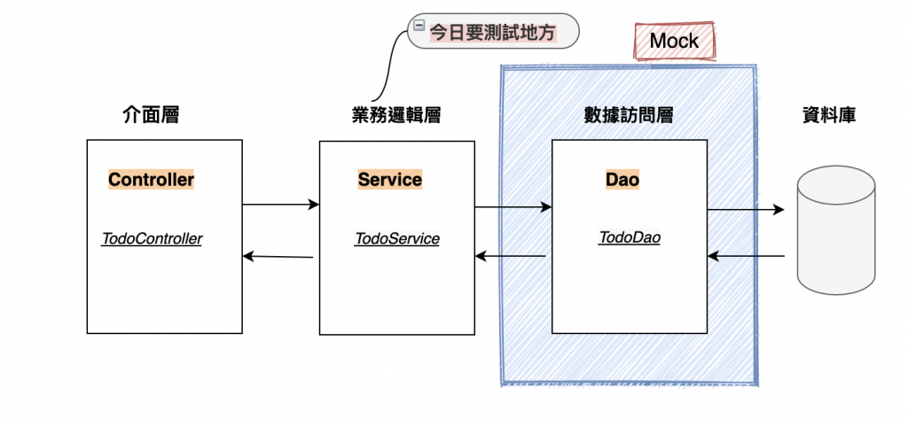

## Mockito 是什麼？

- 一種 Java mock 框架，主要就是用來做 mock 測試的
- 以模擬任何 Spring 管理的 bean、模擬方法的返回值、模擬拋出異常…等，從而可以校驗出這個 mock 對象是否有被正確的順序調用，以及按照期望的參數被調用。
```java
Mockito.when( 對象.方法名() ).thenReturn( 自定義結果 )
```

## SpringBoot 單元測試中使用 Mockito 測試Service
- 建立Spring Boot 專案時已經引入 spring-boot-starter-test dependency時，通常包含了常用的模組 Junit、Spring Test、AssertJ、Mockito 等。

```yml
<dependency>
    <groupId>org.springframework.boot</groupId>
    <artifactId>spring-boot-starter-test</artifactId>
    <scope>test</scope>
</dependency>
```

- Example: updateTodo
```java
@SpringBootTest
public class TestTodoService {
    @Autowired
    TodoService todoService;

    @MockBean
    TodoDao todoDao;

    @Test
    public void testUpdateTodoSuccess(){
        // 準備資料
        Todo todo = new Todo();
        todo.setId(1);
        todo.setTask("寫鐵人賽文章");
        todo.setStatus(1);
        Optional<Todo> resTodo = Optional.of(todo);

        // 定義模擬呼叫todoDao.save(todo) 的回傳結果
        Mockito.when(todoDao.findById(1)).thenReturn(resTodo);

        // [Arrange] 更改的資料
        todo.setStatus(2);

        // [Act]
        boolean actualUpdateRlt = todoService.updateTodo(1, todo);

        // [Assert]
        assertEquals(true, actualUpdateRlt);

    }

    @Test
    public void testUpdateTodoNotExistId(){
        // 準備更改的資料
        Todo todo = new Todo();
        todo.setStatus(2);
        Optional<Todo> resTodo = Optional.of(todo);

        // 定義模擬呼叫todoDao.save(todo) 的回傳結果
        Mockito.when(todoDao.findById(100)).thenReturn(Optional.empty());

        // [Act]
        boolean actualUpdateRlt = todoService.updateTodo(100, todo);

        // [Assert]
        assertEquals(false, actualUpdateRlt);

    }

    @Test
    public void testUpdateTodoOccurException(){
        // 準備更改的資料
        Todo todo = new Todo();
        todo.setId(1);
        todo.setStatus(1);
        Optional<Todo> resTodo = Optional.of(todo);

        // 定義模擬呼叫todoDao.save(todo) 的回傳結果
        Mockito.when(todoDao.findById(1)).thenReturn(resTodo);
        todo.setStatus(2);

        // 模擬呼叫todoDao.save(todo)時發生NullPointerException例外
        doThrow(NullPointerException.class).when(todoDao).save(todo);

        // [Act]
        boolean actualUpdateRlt = todoService.updateTodo(1, todo);

        // [Assert]
        assertEquals(false, actualUpdateRlt);

    }
}
```

# Day 19 - Spring Boot HTTP的請求也可以模擬測試？使用MockMvc

- 於Controller是透過用戶端使用HTTP呼叫的，所以我們要模擬網路的形式，使用MockMvc 來實作Controller層的測試。
- MockMvc這個spring framework 實現了對Http請求的模擬端點測試，能夠直接使用網路的形式，轉換到Controller的呼叫，不依賴網路環境，提供了一套驗證的工具，這樣可以使得請求的驗證統一且方便。

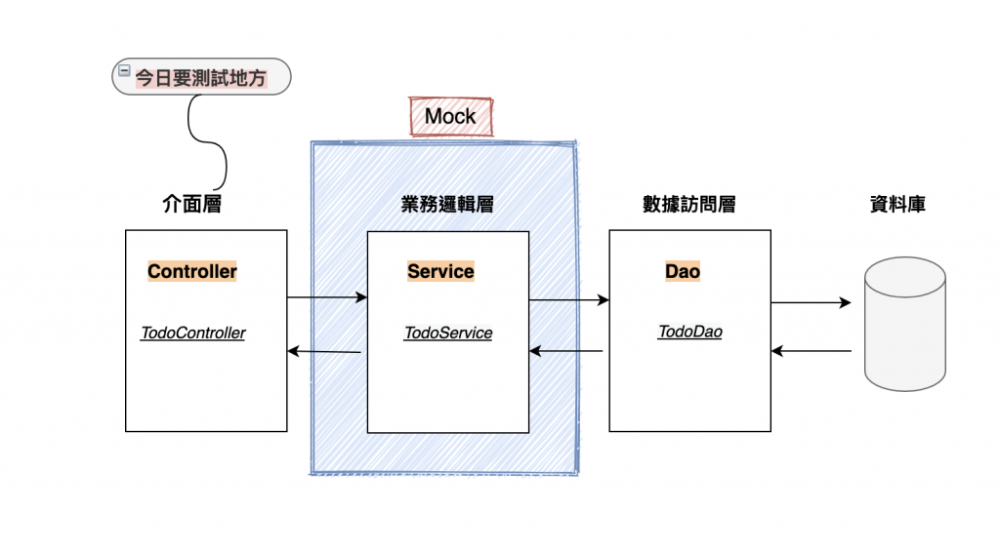

## 設定Controller測試

- @AutoConfigureMockMvc 啟動時自動注入MockMvc
- @MockBean 創造一個假的Service對象
- MockMvc的屬性
  - mockMvc.perform 執行一個請求，並對應到controller。
  - mockMvc.andExpect 期待並驗證回應是否正確。
  - mockMvc.andReturn 最後回應的值(body)，可以再利用這個值，做其他Assert驗證

```java
@SpringBootTest
@AutoConfigureMockMvc
public class TestTodoController {
    @Autowired
    private MockMvc mockMvc;
    
    @Autowired
    ObjectMapper objectMapper;
    
    @MockBean
    TodoService todoService;
}
```

- GetTodos:
  - 遇到中文亂碼問題
    - 在getContentAsString()加上Charset.defaultCharset()
    - getContentAsString(Charset.defaultCharset())

```java
@Test
public void testGetTodos() throws Exception {
    // 設定資料
    List<Todo> expectedList = new ArrayList();
    Todo todo = new Todo();
    todo.setTask("洗衣服");
    todo.setId(1);
    expectedList.add(todo);

    // 模擬todoService.getTodos() 回傳 expectedList
    Mockito.when(todoService.getTodos()).thenReturn(expectedList);

    // 模擬呼叫[GET] /api/todos
    String returnString = mockMvc.perform(MockMvcRequestBuilders.get("/api/todos")
                    .accept(MediaType.APPLICATION_JSON ))
            .andExpect(status().isOk())
            .andReturn().getResponse().getContentAsString(Charset.defaultCharset());

    Iterable<Todo> actualList = objectMapper.readValue(returnString, new TypeReference<Iterable<Todo>>() {
    });

    // 判定回傳的body是否跟預期的一樣
    assertEquals(expectedList, actualList);
}
```

- CreateTodo

```java
@Test
public void testCreateTodo() throws Exception{
    //設定資料
    Todo todo = new Todo();
    todo.setTask("洗衣服");
    todo.setId(1);
    todo.setStatus(1);

    JSONObject todoObject = new JSONObject();
    todoObject.put("id", 1);
    todoObject.put("task", "洗衣服");

    // 模擬todoService.createTodo(todo) 回傳 id 1
    Mockito.when(todoService.createTodo(any())).thenReturn(todo.getId());

    // 模擬呼叫[POST] /api/todos
    String actual = mockMvc.perform(MockMvcRequestBuilders.post("/api/todos")
            .accept(MediaType.APPLICATION_JSON) //response 設定型別
            .contentType(MediaType.APPLICATION_JSON) // request 設定型別
            .content(String.valueOf(todoObject))) // body 內容
            .andExpect(status().isCreated()) // 預期回應的status code 為 201(Created)
            .andReturn().getResponse().getContentAsString();

    assertEquals(1, Integer.parseInt(actual));
}
```

- UodateTodo

```java
@Test
public void testUpdateTodoSuccess() throws Exception{
    // 模擬todoService.updateTodo(1, xxx) 成功，回傳true
    Mockito.when(todoService.updateTodo(eq(1), any())).thenReturn(true);

    JSONObject todoObject = new JSONObject();
    todoObject.put("id", 1);
    todoObject.put("task", "洗衣服");
    todoObject.put("status", 1);

    // 模擬呼叫[PUT] /api/todos/{id}
    mockMvc.perform(MockMvcRequestBuilders.put("/api/todos/1")
            .accept(MediaType.APPLICATION_JSON)
            .contentType(MediaType.APPLICATION_JSON) // request 設定型別
            .content(String.valueOf(todoObject))) // body 內容
            .andExpect(status().isOk()); // 預期回應的status code 為 200(Ok)
}

@Test
public void testUpdateTodoIdNotExist() throws Exception{
    // 模擬todoService.updateTodo(1, xxx) 成功，回傳true
    Mockito.when(todoService.updateTodo(eq(100), any())).thenReturn(false);

    JSONObject todoObject = new JSONObject();
    todoObject.put("id", 1);
    todoObject.put("task", "洗衣服");
    todoObject.put("status", 1);

    // 模擬呼叫[PUT] /api/todos/{id}
    mockMvc.perform(MockMvcRequestBuilders.put("/api/todos/100")
                    .accept(MediaType.APPLICATION_JSON)
                    .contentType(MediaType.APPLICATION_JSON) // request 設定型別
                    .content(String.valueOf(todoObject))) // body 內容
            .andExpect(status().isBadRequest()); // 預期回應的status code 為 200(Ok)
}
```

- DeleteTodo

```java
@Test
public void testDeleteTodo() throws Exception{
    // 模擬todoService.deleteTodo(1) 成功回傳true
    Mockito.when(todoService.deleteTodo(1)).thenReturn(true);

    // 模擬呼叫[DELETE] /api/todos/{id}
    mockMvc.perform(MockMvcRequestBuilders.delete("/api/todos/1")
            .accept(MediaType.APPLICATION_JSON_UTF8) //response 設定型別
            .contentType(MediaType.APPLICATION_JSON)) // request 設定型別
            .andExpect(status().isNoContent()); // 預期回應的status code 應為 204(No Content)
}

@Test
public void testDeleteTodoIdNotExist() throws Exception{
    //
    Mockito.when(todoService.deleteTodo(100)).thenReturn(false);

    //
    mockMvc.perform(MockMvcRequestBuilders.delete("/api/todos/100")
            .accept(MediaType.APPLICATION_JSON_UTF8) //response 設定型別
            .contentType(MediaType.APPLICATION_JSON)) // request 設定型別
            .andExpect(status().isBadRequest()); // 預期回應的status code 為 400(Bad Request)
}
```

# Day 21 - Spring Boot Swagger API 文件神器

## Dependency

```xml
<dependency>
    <groupId>org.springdoc</groupId>
    <artifactId>springdoc-openapi-starter-webmvc-ui</artifactId>
    <version>2.6.0</version>
</dependency>
```

## Controller

```java
@Tag(name = "Todo List api")
@RestController
@RequestMapping("/api")
public class TodoController {

    @Autowired
    private TodoService todoService;

    @PostMapping("/todos")
    @Operation(summary = "createTodo")
    public ResponseEntity createTodo(@RequestBody Todo todo){
        Integer rlt = todoService.createTodo(todo);
        return ResponseEntity.status(HttpStatus.CREATED).body(rlt);
    }
}
```

# Day 23 - Spring Boot 快速建立前端ToDoList專案－ReactJS

## 前端框架－ReactJS 快速建立一個專案

* ReactJS是一個JavaScript library， 透過組件方式組合成前端UI介面，可重複使用的組件，很像樂高積木一樣，從微小組件組合成更大的組件。
* 每個組件都有自己的業務邏輯，維護程式碼較容易。
  * Step 1: 安裝Node.js 下載點
  * Step 2: 建立React模版專案
    * 在cmd輸入以下指令(我是在開Sprint Boot的Intellij輸入)
    * npx create-react-app todolist
    * cd todolist
    * npm start
      * 進入http://localhost:3000/
* 教學並沒有提供CSS

* 資料夾結構

```
|-- public
			|-- index.html # default html
|-- src
    |-- assets  # 靜態檔案
        |-- css # css style
        |-- image # 圖片檔
		    |-- components # 組件
    |-- pages # 頁面檔案
    |-- App.js # 根組件
    |-- index.js # 程式進入點
|-- package.json # 套件配置
```

* TitleBox.js
```js
import React from 'react';

const TitleBox = () => {
    return (
        <div className="title-box">
            <p className="date">2020-10-02</p>
            <p className="quote">溫暖是一種感恩，以熾熱的心去感化另一顆心。</p>
        </div>
    );
};

export default TitleBox;
```

* TodoForm.js
```js
import React from 'react';

const TodoForm = () => {
    return (
        <form class="header">
        <input type="text" id="input" placeholder="New Item..." />
        <button type="submit" class="addBtn">
            Add
        </button>
    </form>
    )
}

export default TodoForm;
```

* TodoItems.js
```js
import React from 'react';

const TodoItems = ()=> {
    return (
        <ul>
        <li>
            洗衣服 <span className="badge bg-red">生活</span>
            <span class="close">X</span>
        </li>
        <li>
            鐵人賽文章<span className="badge bg-blue">學習</span>
            <span class="close">X</span>
        </li>
    </ul>
    )
}

export default TodoItems;
```
* ToDo.js 把組件組起來，並給根組件使用
```js
import React from 'react';
import TitleBox from '../components/TitleBox'
import TodoForm from '../components/TodoForm'
import TodoItems from '../components/TodoItems'

const ToDoList = () => {
    return (
        <div className="container">
            <TitleBox/>
            <div className="todo-box">
                <TodoForm/>
                <TodoItems/>
            </div>
        </div>
    );
};

export default ToDoList;
```


# [站在Web前端人員角度，學習 Spring Boot 後端開發 系列](https://ithelp.ithome.com.tw/users/20118857/ironman/3007)

# Reference

- [Spring Boot 零基礎入門 系列](https://ithelp.ithome.com.tw/articles/10339561)

- [站在Web前端人員角度，學習 Spring Boot 後端開發 系列](https://ithelp.ithome.com.tw/users/20118857/ironman/3007)